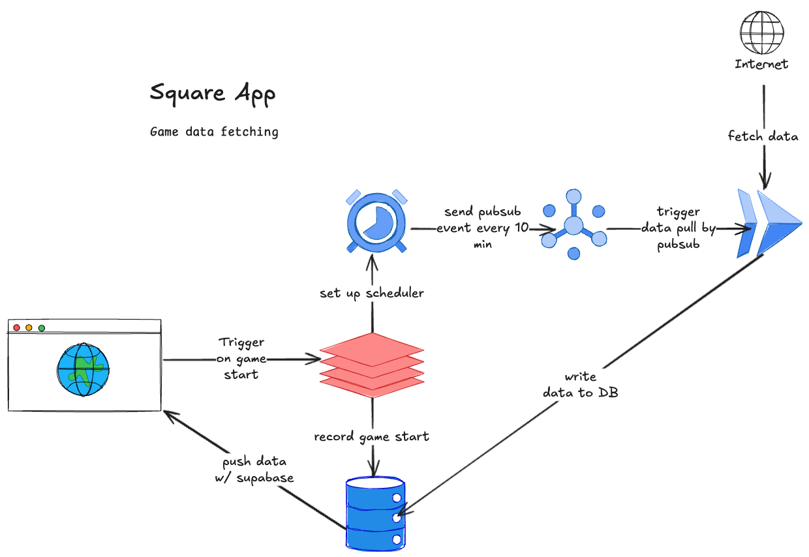

# Game Data Ingestion

## Components

1. **Frontend (UI)**: A web-based interface where users initiate a game.
2. **Backend (API)**: Handles game start, records sessions in the database, and sets up a data-fetching scheduler.
3. **Google Cloud Scheduler**: Schedules Pub/Sub events to trigger data fetches every 10 minutes.
4. **Google Pub/Sub**: Event-driven communication system triggering the data-fetching process.
5. **Google Cloud Run**: A serverless environment that fetches game data from external APIs.
6. **Database**: Stores game session and fetched data.
7. **Supabase**: Pushes real-time data updates to the client's UI.

## Workflow

1. **Game Start**: User triggers the game start via UI. The backend stores the session in the database.
2. **Scheduler Setup**: The backend configures Google Cloud Scheduler to trigger Pub/Sub events every 10 minutes.
3. **Data Fetching**: Pub/Sub triggers Google Cloud Run to fetch game data from external sources.
4. **Data Storage**: The fetched game data is stored in the database.
5. **Real-time Updates**: Supabase synchronizes and pushes the updated game data to the client in real time.

## Technologies

- **Frontend**: React.js for UI.
- **Backend**: Node.js with Express.
- **Google Cloud Services**: Cloud Scheduler, Pub/Sub, and Cloud Run.
- **Database**: PostgreSQL (via Supabase).
- **Real-time Sync**: Supabase for live updates.
